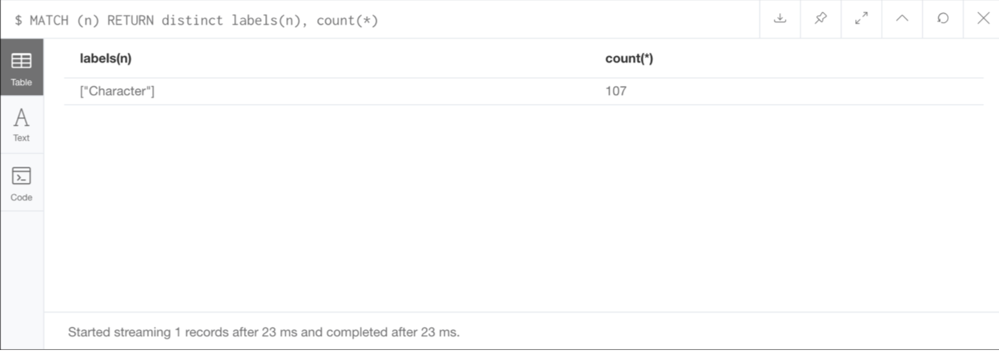
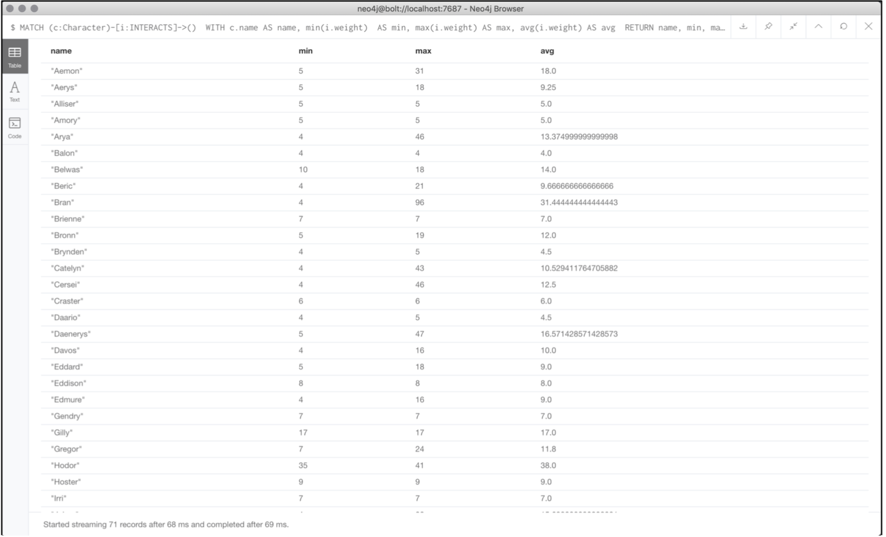
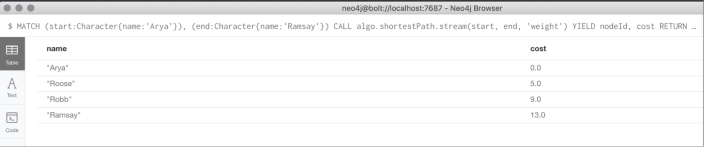
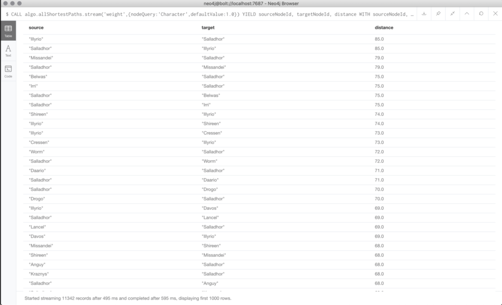
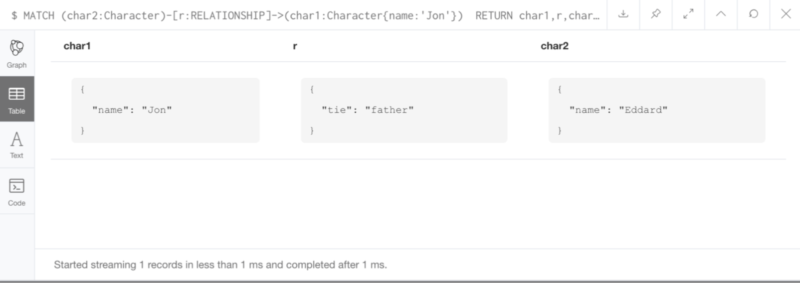
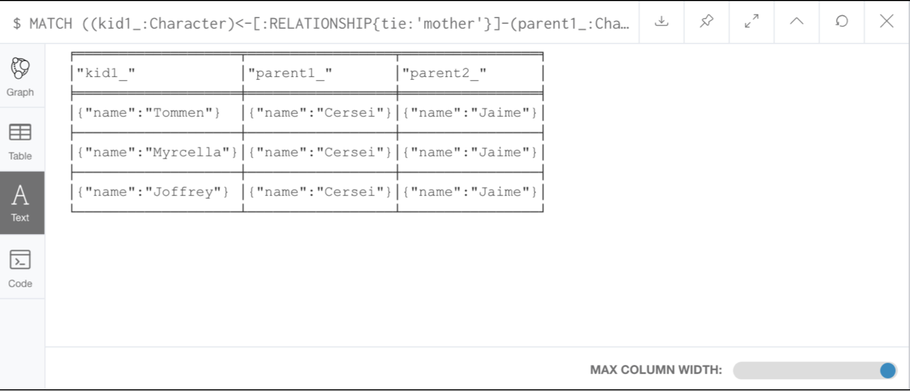
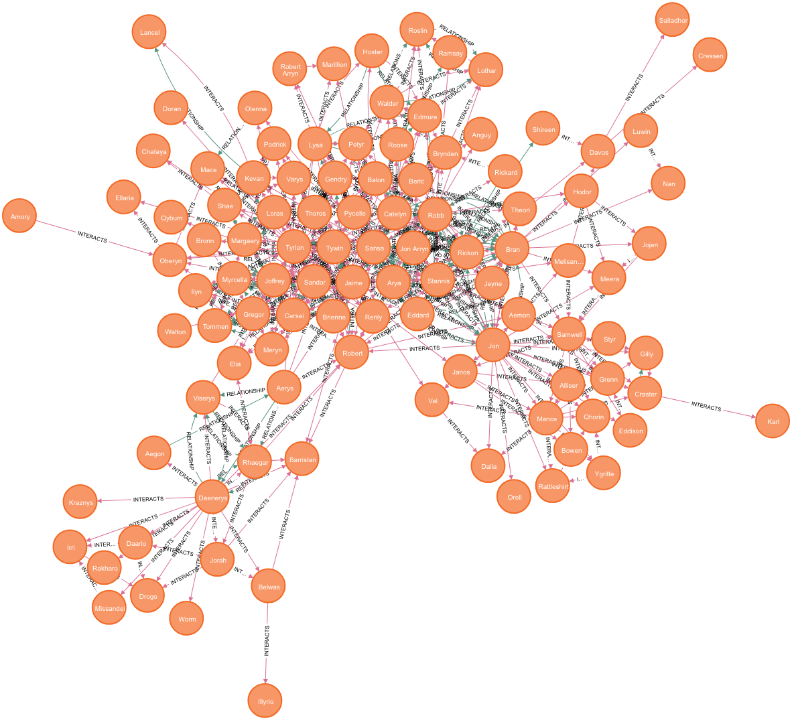

# neo4j Practices on Game of Thrones Dataset

- This repository belongs to an assignment of CENG790 Big Data Analytics Course, METU.

- Detailed assignment description can be found [here](./doc/assignment-definition.pdf). 

- A more detailed technical report is available [here](./doc/report.pdf).

- The complete list of cypher queries is [here](./main.cypher).

## Dataset  
- [stormofswords.csv](./data/stormofswords.csv) includes `Source`, `Target`, `Weight` where Source and Target represent characters from the books, while the weight quantifies the number of interactions between these two characters.

- [family_ties.csv](./data/family_ties.csv) includes information on the family ties between the characters.

## Analysis

### Finding the number of characters in the graph:
`MATCH (n) RETURN distinct labels(n), count(*)` 

The total number of characters is 107. The related screenshot from Neo4j Desktop is available in Figure 1. 

<figure>
  
  <figcaption>Fig.1 - Screenshot from Neo4j showing the number of total characters in the graph.</figcaption>
</figure>


### Summary  statistics  for each character:

The summary  statistics  for  the  minimum,  maximum  and  average  number  of  characters  each character has interacted with is achieved with the following cypher query:

```
MATCH (c:Character)-[i:INTERACTS]->() 
WITH c.name AS name, min(i.weight) 
AS min, max(i.weight) AS max, avg(i.weight) AS avg 
RETURN name, min, max, avg
```
The resulting screenshot is given in Figure 2.

<figure>
  
  <figcaption>Fig.2 - Summary statistics for the minimum, maximum and average number of characters each character has interacted with.</figcaption>
</figure>


### Finding the shortest path between two characters:
In order to find the shortest path between two characters (i.e. from Arya to Ramsay), I tried the default shortestPath algorithm defined in the Neo4j. But this function does not take into account the weight property and calculate the distance as the steps between source and target nodes.For our case (Arya -> Ramsay), the shortest path results with 2 steps which does not consider the weights.  

For this reason, I installed the plugin of [Graph  Algorithms](https://github.com/neo4j-contrib/neo4j-graph-algorithms) implemented for Neo4j and used the shortest path algorithm within this library. The related query is given below:  

```
// Shortest path from Arya to Ramsay –Graph Algorithms implementation
MATCH (start:Character{name:'Arya'}), (end:Character{name:'Ramsay'})
CALL algo.shortestPath.stream(start, end, 'weight')
YIELD nodeId, costRETURN algo.asNode(nodeId).name AS name, cost
```

The result is given in Figure 3. Shortest path beween Arya and Ramsay is 13.

<figure>
  
  <figcaption>Fig.3 - Shortest path between the characters Arya and Ramsay.</figcaption>
</figure>


### Finding the longest shortest path between any two characters:
To find the longest shortest path within the graph, I used  `algo.allShortestPaths.streamfunction`  from  the  Graph  Algorithms  plugin.  The query is in the following form:

```
// Finding the longest shortest path!
CALL algo.allShortestPaths.stream('weight',{nodeQuery:'Character',defaultValue:1.0})
YIELD sourceNodeId, targetNodeId, distance
WITH sourceNodeId, targetNodeId, distance
WHERE algo.isFinite(distance) = true
MATCH (source:Character) WHERE id(source) = sourceNodeId
MATCH (target:Character) WHERE id(target) = targetNodeId
WITH source, target, distance WHERE source <> target
RETURN source.name AS source, target.name AS target, distance
ORDER BY distance DESC
```

The longest shortest pathes are given in Figure 4.

<figure>
  
  <figcaption>Fig.4 - The list of longest shortest pathes between any 2 characters.</figcaption>
</figure>

### Finding the parents of a given character:
In order to find the parents of a character (Jon Snow for our case), the following query is used:

```
MATCH (char2:Character)-[r:RELATIONSHIP]->(char1:Character{name:'Jon'}) 
RETURN char1,r,char2;
```

The screenshot in Figure 5 illustrates the parents of Jon Snow.

<figure>
  
  <figcaption>Fig.5 - The parents of Jon Snow.</figcaption>
</figure>

### Creating 'Sibling' relationship:
The dataset ([family_ties.csv](./data/family_ties.csv)) consists of only `father` and `mother` relationships. In order to create `Sibling` ties between the characters, I used the following query:

```
// Creating the sibling relationships.
MATCH ((kid1:Character)<-[:RELATIONSHIP]-(parent1:Character)),
((kid2:Character)<-[:RELATIONSHIP]-(parent2:Character)) 
WHERE parent1.name=parent2.name
CREATE (kid1)-[r:RELATIONSHIP{tie:'Sibling'}]->( kid2)
```

### Finding the children of an incestuous relationship:

To find the children of an incestuous relationship, I defined such a rule that if a character’s mother and father are siblings, then this character is a child of an incestuous relationship. For this purpose, I used the following query:

```
// children of incestuous relationships!
MATCH ((kid1_:Character)<-[:RELATIONSHIP{tie:'mother'}]-(parent1_:Character)),
((kid1_:Character)<-[:RELATIONSHIP{tie:'father'}]-(parent2_:Character)) 
WHERE (parent1_:Character)<-[:RELATIONSHIP{tie:'Sibling'}]-(parent2_:Character)
RETURN kid1_,parent1_,parent2_
```

The children of an incestuous relationship are listed in Figure 6.
<figure>
  
  <figcaption>Fig.6 - The children of an incestuous relationship.</figcaption>
</figure>


## The final version of the graph
<figure>
  
  <figcaption>Fig.7 - The final graph.</figcaption>
</figure>

